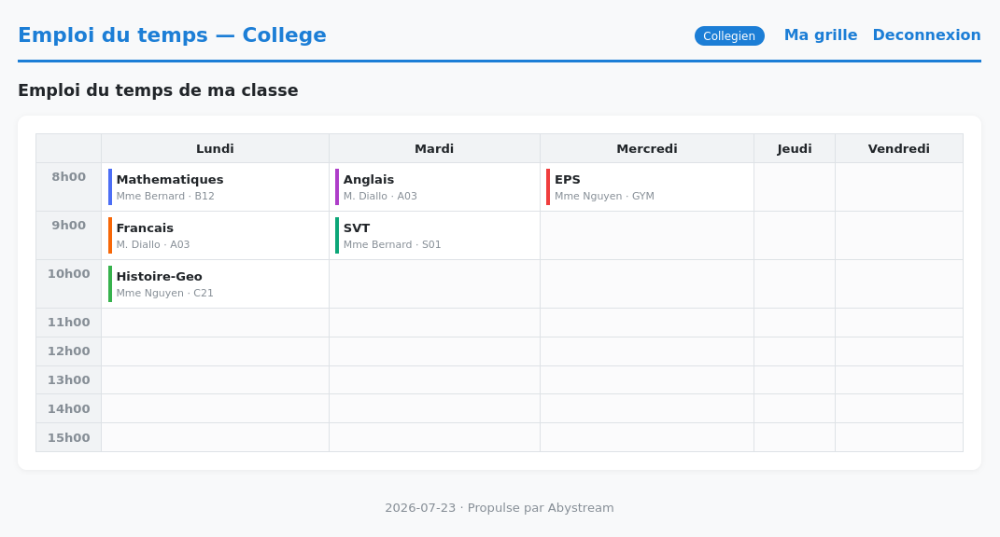

# Emploi du temps — Abystream

Cette application est une démonstration d'une application web développée avec **Abystream**, le framework web pour **MATL-ABC**.

## Démo

### Emploi du temps d'une classe

L'application permet notamment de consulter l'emploi du temps d'une classe selon le rôle de l'utilisateur.

## Fonctionnalités

* Authentification des utilisateurs
* Gestion des rôles
* Consultation de l'emploi du temps
* Interface dédiée à la gestion de la scolarité
* Ajout et suppression de cours
* Vérification des conflits horaires
* Rendu HTML côté serveur
* Authentification par JWT

## Technologies

* **MATL-ABC**
* **Abystream**
* HTTP
* HTML
* JWT
* SQLite

## À propos

Cette application a été réalisée afin de mettre en pratique les fonctionnalités fournies par **Abystream** et de démontrer la construction d'une application web complète avec le framework.
